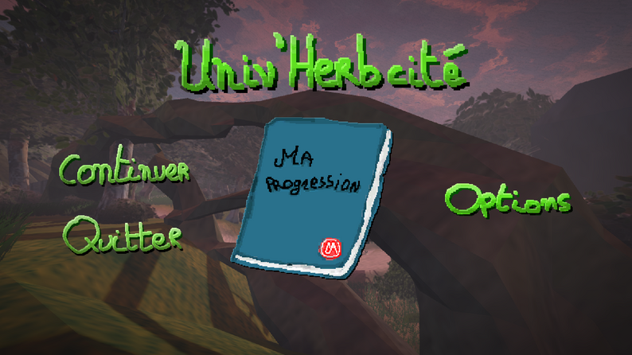

**Univ'Herbcité** is a serious game developed with **Godot Engine**.\
It was created as part of a project on the theme “**Studying at the University of Montpellier**”.

The game combines **exploration** and **puzzle-solving** on a reimagined version of the university campus.
You play as a student who wakes up lost in the middle of the grounds. To find your way out, you’ll need to **observe**, **identify**, and **study** the plants growing around the campus — each revealing clues that help you progress.

Through this experience, players are encouraged to discover the botanical richness of the university’s environment while reflecting on the link between **nature and learning**.

<!--  -->

Links to the project :
- [ITCH](https://azouuuu.itch.io/univherbcite) : Game page
- [GitHub](https://github.com/RTheoGH/UnivHerbcite) : Source code